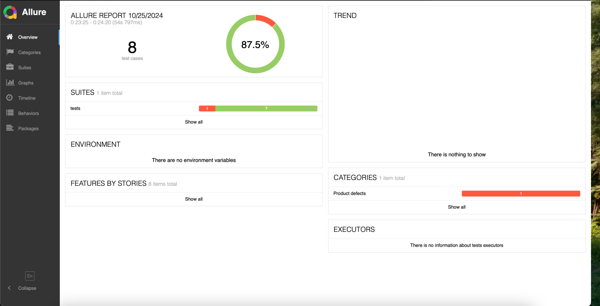

## Chaos Test Challenge

## Getting started
```
git remote add origin https://github.com/IAMRAAJRSARWAN/gui-chaos-pytest.git
git branch -M main
git push -u origin main

Best Practices : Create PR All the time

git status
git add . | git add <required Files>
git commit -m "Commit Message"
git push -u origin <branchName>

Create PR in GitHub and Set it for Approval
```

## Installation - Local

```
Clone Repo: 

https://github.com/IAMRAAJRSARWAN/gui-chaos-pytest.git

installation of packages: 

poetry install
```

## Installation - Virtual Env of Python

```
Clone Repo: 

https://github.com/IAMRAAJRSARWAN/gui-chaos-pytest.git

installation of packages: 

1. poetry install
2. python3 -m venv venv
3. source venv/bin/activate
4. pip install pytest | pyAutiGUI | allure-pytest | imagehash | python-dotenv 
5. Above Python Packages Required in your VEnv to Perform Test

```

## Project Structure
```
Directory:
    Root of Project
        tests: contains all Tests Dir (Can be Configurable in pyproject.toml)
        fixtures: 
            images - contains test data's Images, 
            screenshots - Screenshots (Error Screenshots)
        globals:
            config - can configure OS Config, Env Config
            functions - App Related Functions , Generic Functions, Assert Functions
```

## Project Implementation Approach
```
1.  I have been used Mac OS and Preview Image Editor App for Tests 
    Optional : Can Configure for Windows and Image Editors But Due to my Hardware/Software Dependencies Test for Mac OS
 
2.  GitHub Actions for Execute Tests on Each Push to Master Would Helps to Make sure Tests are Good. 
    GitHub Pages for Allure Reporter
    
```

## Tests Implementation Approach
```
1.  Under globals > functions dir : Implemented Required Actions and Assers Functions for Preview. 
    Ex: If the Project Required other Tools Can be Extend and Implement Actions, Asserts Functions for Ms Paint App

```

## Image Comparison Approach
```
    Image Hash Python Packages has been used for Image Comparison
    average Hash Algorithm
    perceptual Hash Algorithm
    Color Hash Algorithm
```

## Usage
```
Config Designed to Run Tests Only For Mac OS with Preview App
Integrated Package.json to harnesss the benefits of Test Run Scripts  

To Execute Tests: All Tests Will Execute : Default OS : Mac OS : Preview App 
    
To Execute Tests:

    npm run test:pytest
    
To Build and Show Report: Required JDK/JRE in Local Machine / In CI Image

    npm run allure:report
    
```

## GitHub CI Actions Test Run
```
In GitHub Actions Following Test will Execute All Tests and Generate Report

Implemented Scheduled CI Job for Every 4 Hours TestRuns To Scale Stability - 100 % Stablility.

Report will be Generated , View in GitHub Pages (Static Pages for Allure Report)

Report URL: https://iamraajrsarwan.github.io/gui-chaos-pytest/index.html

IMPORTANT: To Enable Report Feature , Repo must be in Public Visibility

CAUTION: In Allure Report Error Screenshot not attaching Properly - InProgress/WIP

```

## Report Allure
```    
To Build and Show Report: Required JDK/JRE in Local
    allure serve allure-results | npm run allure:report
    
 - Can See Example Allure Report in Root of Project

```

## Authors
```
Saravanan Rajamanickam
Chaos Test Challenge
```